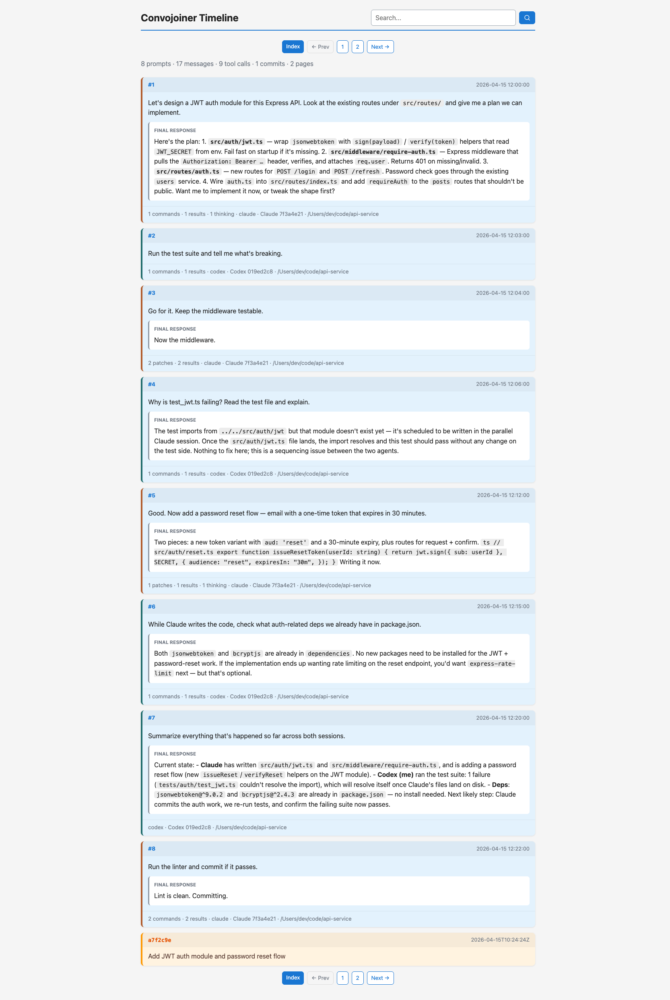
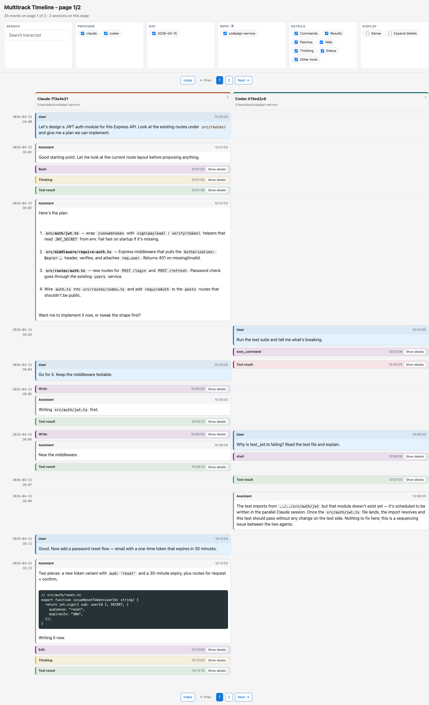

# Convojoiner

[](https://github.com/akurilin/convojoiner/actions/workflows/ci.yml)
[](https://deepwiki.com/akurilin/convojoiner)
[](LICENSE)
[](https://www.python.org/)
[](https://www.anthropic.com/claude-code)
[](https://github.com/cline/cline)
[](https://openai.com/codex)
[](https://github.com/Yelp/detect-secrets)

Convojoiner generates a static HTML archive that joins local coding-agent
session transcripts from Claude Code, Cline, and Codex into one browseable
timeline.

The tool treats the original transcript stores as strictly read-only. It
discovers sessions under each provider's storage directory, parses them in
place, and writes the HTML archive to a separate output directory.

## Screenshots

The generated archive has two views. An **index** listing every user prompt
across every session, searchable, with provider-colored borders so you can tell
at a glance which tool drove which turn:



And a **paginated timeline** showing concurrent sessions as side-by-side
lanes grouped by minute — here, Claude Code writing the auth module on the
left while a Codex session runs the test suite and investigates the failure
on the right, on the same repo, at the same time:



## Prior art

Inspired by Simon Willison's
[simonw/claude-code-transcripts](https://github.com/simonw/claude-code-transcripts),
which renders a single Claude Code session directory to HTML. Convojoiner extends
that idea in a few directions:

- **Multiple local folders** — scope the archive to one or more repo/worktree
  paths with repeated `--repo-folder` flags.
- **Multiple concurrent sessions** — built for developers running several
  coding agents in parallel on the same project, often from different vendors
  (e.g. Claude Code in one terminal and Codex in another, both touching the
  same repo or across a few worktrees of it). All sessions are laid out
  side-by-side in per-minute lanes instead of collapsed into a single linear
  log, so parallel work stays visually separate and easy to follow. This is
  the core problem the tool was built to solve.
- **Multiple providers** — Claude Code, Cline (the `saoudrizwan.claude-dev` VS
  Code extension), and Codex are parsed out of the box behind a common adapter
  interface, so adding another tool (OpenCode, Gemini, Amp, Cursor, Aider, …)
  is a matter of writing one `SessionAdapter` subclass.
- **Secret redaction** — every rendered transcript is first scrubbed through
  Yelp's [`detect-secrets`](https://github.com/Yelp/detect-secrets) plus a
  handful of custom detectors for keys the upstream doesn't cover (Anthropic
  `sk-ant-*`, OpenAI project keys, GitHub fine-grained PATs, Google API/OAuth,
  Supabase new-format keys, PEM private-key blocks). Credentials that ended
  up in your conversations don't leak into a static HTML page you might share.

## Usage

Generate an HTML transcript scoped to two separate projects since April 19, 2026:

```bash
python3 convojoiner.py \
  --since 2026-04-19 \
  --timezone Europe/Rome \
  --repo-folder ~/code/project-a \
  --repo-folder ~/code/project-b \
  --output ./convojoiner
```

If you use git worktrees heavily (`project`, `project-feature-x`,
`project-bugfix`, …), `--repo-folder-prefix` catches all of them in one
flag instead of listing each worktree path:

```bash
python3 convojoiner.py \
  --since 2026-04-19 \
  --repo-folder-prefix ~/code/project \
  --output ./convojoiner
```

The prefix flag matches the given path exactly or extended with `/`, `-`,
`_`, or `.`, so `~/code/project` catches worktrees like
`project-feature-x` and `project_hotfix` as well as subdirectories like
`project/docs`. A purely letter-continuing sibling like `~/code/projects`
or `~/code/projectapi` will **not** match. Be aware that any sibling
path starting with `project-` will be grouped too — if that matters,
use `--repo-folder` instead for strict subfolder-only matching.

Preview what would be selected without copying or writing output:

```bash
python3 convojoiner.py \
  --since 2026-04-19 \
  --timezone Europe/Rome \
  --repo-folder ~/code/project-a \
  --dry-run
```

Include only one provider (repeatable):

```bash
python3 convojoiner.py --provider codex --since 2026-04-19
python3 convojoiner.py --provider claude --since 2026-04-19
python3 convojoiner.py --provider cline --since 2026-04-19
```

Claude Code subagent JSONL files are included by default. Exclude them with:

```bash
python3 convojoiner.py --no-subagents
```

## Output

The generated archive contains:

- `index.html`: an index page with prompt cards, deterministic final-response
  excerpts, tool counts, commit cards extracted from git output, stats, search,
  and links to every transcript page.
- `page-001.html`, `page-002.html`, and so on: precomputed transcript pages,
  each containing a fixed number of user prompt turns. Use `--page-prompts` to
  change the default of 5 prompt turns per page.

Each transcript page renders one column per session or subagent that has events
on that page, grouped by minute so concurrent work stays visually separated
without putting the full archive in one document.

User and assistant messages render expanded by default and are not part of the
detail hide/show filter. Technical details such as commands, results, patches,
web calls, thinking, status, and other tools render as compact expandable rows
and can be hidden by category.

Transcript pages include client-side filters for provider, day, repo folder,
detail category, session, and search text, scoped to that precomputed page. The
archive does not load external assets or make network requests.

## Source Stores

Default source locations (macOS):

- Claude Code: `~/.claude/projects`
- Codex: `~/.codex/sessions`
- Cline: `~/Library/Application Support/Code/User/globalStorage/saoudrizwan.claude-dev`

Use `--claude-source`, `--codex-source`, or `--cline-source` to point at
alternate stores (e.g. copies you've archived elsewhere, or non-macOS
locations).
